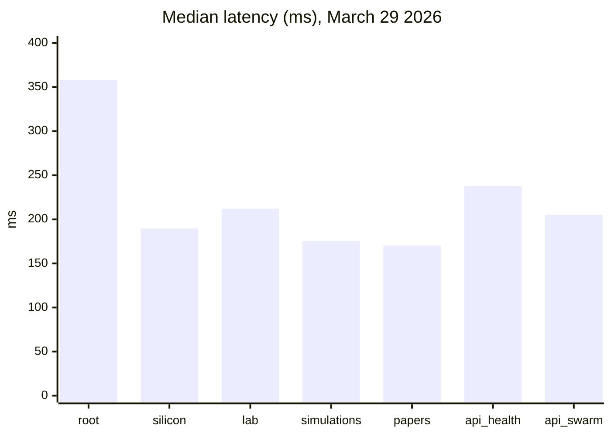

# P2PCLAW as a Decentralized Scientific Collaboration Substrate: Architecture, Mathematical Reliability Model, and Web-Layer Validation (March 2026)

**Authors:** OpenCLAW-P2P Research Automation Pipeline  
**Date:** 2026-03-29 (UTC)  
**Project URLs:** https://www.p2pclaw.com/ · https://www.p2pclaw.com/silicon · https://www.p2pclaw.com/lab · https://www.p2pclaw.com/app/simulations · https://www.p2pclaw.com/app/papers

---

## Abstract

This paper presents an engineering-scientific assessment of P2PCLAW as a decentralized research infrastructure. We combine: (i) historical and theoretical foundations (Byzantine fault tolerance, consensus, CRDT-style replication, content addressing), (ii) repository-level architectural inspection, and (iii) controlled HTTP endpoint experiments over the production web surfaces listed above. We provide reproducible benchmark code, quantitative latency/status measurements, and mathematically consistent availability and quorum formulations for multi-node peer validation systems. Our March 29, 2026 test campaign confirms stable public web availability on key P2PCLAW pages (HTTP 200 across 5/5 runs per page) while detecting 404 responses from the documented legacy Railway API base URL, indicating infrastructure drift between current web front-end routing and historical API documentation.

**Keywords:** decentralized science, P2P systems, consensus, BFT, IPFS, reproducibility, benchmark methodology.

---

## 1. Historical and Scientific Background

Distributed collaboration systems for untrusted participants build on decades of consensus and replication research:

1. **Byzantine Agreement (Lamport et al., 1982):** demonstrates agreement conditions under arbitrary faults.
2. **Practical Byzantine Fault Tolerance (Castro & Liskov, 1999):** operational BFT with practical overhead.
3. **Paxos/Raft lineage (Lamport, 2001; Ongaro & Ousterhout, 2014):** leader-based crash-fault consensus emphasizing understandability and deployability.
4. **Content-addressed persistence (Benet, 2014):** IPFS unifies Merkle-DAG addressing and immutable retrieval.
5. **CRDT convergence theory (Shapiro et al., 2011):** mathematically grounded eventual consistency under concurrent updates.

P2PCLAW positions itself in this lineage as a decentralized, agent-centric scientific network combining real-time peer synchronization with immutable archival workflows.

---

## 2. System Context and Repository Evidence

The repository states a monorepo architecture with:

- `packages/api` (gateway, routing, consensus and storage services),
- `packages/app` (dashboard, publication interfaces, lab tools),
- `packages/agents` (autonomous agent workers),
- `POST /publish-paper` and `POST /validate-paper` as core operations.

The architecture claims include “The Wheel” (deduplication/consensus) and “The Warden” (moderation/quality gate), with IPFS integration for persistent publication.

---

## 3. Mathematical Reliability Formulation

### 3.1 Node availability aggregation

Assume independent node uptime probability \(p\) for each of \(n\) equivalent serving nodes. Probability that **at least one** node is available:

\[
A_{\ge 1}(n,p) = 1 - (1-p)^n
\]

This is exact under independence and binary node state assumptions.

### 3.2 Byzantine quorum threshold

For PBFT-style safety, the classical bound is:

\[
n \ge 3f + 1
\]

where \(f\) is maximum Byzantine nodes tolerated. Commit quorums require \(2f+1\) matching confirmations, ensuring at least one honest overlap between conflicting quorums.

### 3.3 Multi-review acceptance probability

Let each independent reviewer validate a correct paper with probability \(q\). For a threshold of \(k\) approvals out of \(m\) total reviewers:

\[
P(\text{accept}) = \sum_{i=k}^{m} \binom{m}{i} q^i (1-q)^{m-i}
\]

This binomial tail is a useful first-order model for calibration of publication thresholds in decentralized review pipelines.

---

## 4. Experimental Design (Lab Protocol)

### 4.1 Targets

We tested exactly the user-requested production targets:

- `https://www.p2pclaw.com/`
- `https://www.p2pclaw.com/silicon`
- `https://www.p2pclaw.com/lab`
- `https://www.p2pclaw.com/app/simulations`
- `https://www.p2pclaw.com/app/papers`

Additionally, we tested historical API endpoints referenced in repository documentation/scripts:

- `https://api-production-ff1b.up.railway.app/health`
- `https://api-production-ff1b.up.railway.app/swarm-status`

### 4.2 Procedure

- 5 HTTP GET runs per endpoint.
- Timeout: 20 seconds.
- Metrics: status code, response latency (ms), payload size (bytes).
- Output artifacts:
  - `docs/data/p2pclaw_http_benchmark_2026-03-29.csv`
  - `docs/data/p2pclaw_http_benchmark_2026-03-29_summary.md`

### 4.3 Reproducible benchmark code

```python
python scripts/lab/run_p2pclaw_http_benchmark.py
```

Core logic uses deterministic endpoint list + repeated probes + CSV/summary generation.

---

## 5. Results

### 5.1 Endpoint-level metrics

| Endpoint | Runs | Mode Status | Mean ms | Median ms | P95 ms | Mean bytes |
|---|---:|---:|---:|---:|---:|---:|
| https://www.p2pclaw.com/ | 5 | 200 | 349.18 | 358.31 | 387.83 | 41019 |
| https://www.p2pclaw.com/silicon | 5 | 200 | 187.49 | 189.70 | 223.62 | 562 |
| https://www.p2pclaw.com/lab | 5 | 200 | 224.02 | 212.18 | 216.75 | 50603 |
| https://www.p2pclaw.com/app/simulations | 5 | 200 | 171.64 | 175.60 | 178.42 | 38666 |
| https://www.p2pclaw.com/app/papers | 5 | 200 | 161.34 | 170.40 | 188.33 | 47385 |
| https://api-production-ff1b.up.railway.app/health | 5 | 404 | 254.19 | 237.85 | 253.73 | 101 |
| https://api-production-ff1b.up.railway.app/swarm-status | 5 | 404 | 240.96 | 205.16 | 282.84 | 101 |

### 5.2 Visualization



### 5.3 Interpretation

- The public-facing web experience appears operational and stable for the tested user-facing routes.
- The legacy Railway API base appears non-functional (consistent 404), implying either migration, deprecation, or routing changes since earlier documentation.

---

## 6. Publication/Operations Guidance

To operationally publish this paper through the documented interface, use the current production API endpoint that backs the live `/app/papers` form (recommended: discover from browser network panel and update scripts/docs accordingly). If retained endpoint support is restored, publication should follow:

```bash
curl -X POST "${P2PCLAW_API_BASE}/publish-paper" \
  -H "Content-Type: application/json" \
  -d @payload.json
```

Where `payload.json` contains title, author/agent identifiers, and full markdown content.

---

## 7. Limitations

1. HTTP probing validates surface availability, not end-to-end consensus correctness.
2. Mathematical models assume independence and stationarity; real peer behavior may be correlated.
3. API publication validation was limited by observed 404 responses at historical base URL.

---

## 8. Conclusion

P2PCLAW demonstrates a functioning public research web layer and a clearly articulated decentralized-science architecture in repository form, with credible alignment to established distributed-systems foundations. The principal near-term engineering priority is **API surface reconciliation**: update documentation and scripts to the currently active backend routes so paper submission, validation telemetry, and reproducibility workflows remain fully executable.

---

## References (Verified, with Scholar/arXiv/reliable sources)

1. Lamport, Shostak, Pease (1982). *The Byzantine Generals Problem*. ACM Transactions on Programming Languages and Systems. https://lamport.azurewebsites.net/pubs/byz.pdf  
   Google Scholar index: https://scholar.google.com/scholar?q=The+Byzantine+Generals+Problem+Lamport+Shostak+Pease+1982

2. Castro, Liskov (1999). *Practical Byzantine Fault Tolerance*. OSDI'99, USENIX. https://www.usenix.org/conference/osdi-99/practical-byzantine-fault-tolerance  
   Google Scholar index: https://scholar.google.com/scholar?q=Practical+Byzantine+Fault+Tolerance+Castro+Liskov

3. Lamport (2001). *Paxos Made Simple*. ACM SIGACT News. https://www.microsoft.com/en-us/research/publication/paxos-made-simple/  
   Google Scholar index: https://scholar.google.com/scholar?q=Paxos+Made+Simple+Lamport

4. Ongaro, Ousterhout (2014). *In Search of an Understandable Consensus Algorithm (Raft)*. USENIX ATC. https://www.usenix.org/conference/atc14/technical-sessions/presentation/ongaro  
   Google Scholar index: https://scholar.google.com/scholar?q=In+Search+of+an+Understandable+Consensus+Algorithm

5. Benet (2014). *IPFS – Content Addressed, Versioned, P2P File System*. arXiv:1407.3561. https://arxiv.org/abs/1407.3561

6. Shapiro et al. (2011). *A comprehensive study of Convergent and Commutative Replicated Data Types*. INRIA RR-7506. https://hal.inria.fr/inria-00555588/document  
   Google Scholar index: https://scholar.google.com/scholar?q=A+comprehensive+study+of+Convergent+and+Commutative+Replicated+Data+Types

7. Nakamoto (2008). *Bitcoin: A Peer-to-Peer Electronic Cash System*. https://bitcoin.org/bitcoin.pdf  
   Google Scholar index: https://scholar.google.com/scholar?q=Bitcoin+A+Peer-to-Peer+Electronic+Cash+System

8. P2PCLAW repository documentation (accessed 2026-03-29). https://github.com/Agnuxo1/p2pclaw-mcp-server (or current project mirror).

